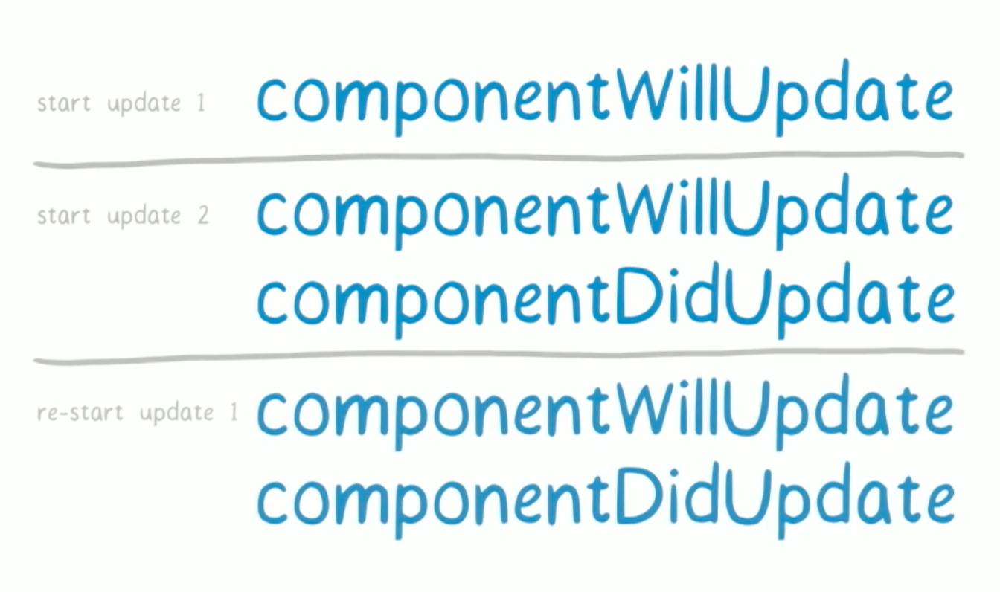

# 图解 fiber

[视频链接](https://www.youtube.com/watch?v=ZCuYPiUIONs)

具体栗子和细节请看↑的视频

(以下纯属我的理解，如有错误望指正)

### 一个栗子说起

左边是16版本之前的 stack reconciler 算法，而右边是 fiber reconciler 算法

这里有两个地方的渲染更新，一个是左右的旋转变化，另一个是每一个白色的小点都要改变数字，显然计算量是很大的。所以能够看得到的是： fiber 的渲染出来的明显更加友好

###首先，来区分一下 reconciler 和 renderer

>  The **reconciler** is the part of React which contains **the algorithm used to diff one tree with another** to determine which parts need to be changed.

reconciler 就涉及到了我们常说的 virtual dom，virtual dom 在 react 源码中没有明说，但是确实存在在 react reconciler 文件里面。

renderer 就涉及到了我们经常使用的 react-dom 、react-native 以及其他一些库了。

stack reconciler 的 virtual dom 方式是递归遍历某一个节点的所有孩子节点，查看是否需要更新然后立即应用更新，这其中就是一个同步过程。

### 然后来看 Animation

玩过游戏的我们都知道，对于一个流畅的 GUI 界面而言，最低要求 FPS 刷新率最低要求 60 帧/s ，而我们用的 js 中常用的单位是毫秒：

>  1s = 1000ms
>
>  60 FPS / s -> (16|17)ms / FPS

### 然鹅

我们很多时候，渲染或者更新单个组件需要的时间很少，可能不到 1ms 就可以实现更新和渲染，所以一般情况下也就是我们的应用使用 stack reconciler 的计算量很小的情况下，没有明显感受到卡顿，但是达到一定数量级之后，显然这个同步过程会阻塞掉主线程的 css、layout 等 ui 界面处理。

但是现实生活中的应用不可能总是如我们想要的那样简单，如果应用一旦复杂，显然使用 stack reconciler 会阻塞主线程的动画等，使得像上面栗子那样能感受到明显的卡顿。解决这样的问题思路有很多，可以从两个方面看：

-  从硬件层上通过提高 cpu 的性能加快渲染速度，但是这是不现实的，尤其我们还要做跨平台开发，前端不可能搞得像游戏那样写个最低配置需要什么什么的（比如写个最低配置要求 iPhone X。。。）；还有一种就是多线程技术或模拟多线程技术，尽管这样的未来确实很美好，但是 html5 的 worker 推广起来怕是需要漫长一段时间的，所以短时间内还是不能靠未来的美好设想（暂不论 worker ，貌似又给自己挖了个要填的坑）

-  那么从软件层上来看，

   1. 一是我们不断提高 React 本身的性能
   2. 二是让开发者自己优化代码，让他们自己搞定这件事情
   3. 三是让 React 换一种新的架构，帮助用户处理用户自己的代码。

   显然1是不行的，因为 react 本生代码运行已经很快很快了，真正让在渲染和更新过程中占用主线程并非 react 自身，主要还是用户自己写的代码逻辑；而这又不可能老让用户自己去不断优化代码，而且有些应用情况非常非常复杂；所以为了让我们这些优lan秀duo的都省事(我猜的)，react 把核心算法重写了一次，这也就是 fiber reconsiler 出现了。

而 fiber 所要做的事情就是让比对新旧情况与应用更新两种操作分离，也就是我们后面会说到的分阶段(phase)

## stack reconciler

同时我们大家都知道 JavaScript 有他的函数调用栈，而我们可以从 react 的源码中看到（没看到就去看吧。。。眼见为实），在使用 stack reconciler 对某节点进行递归遍历时，调用栈就会越来越越来深，向下面酱紫：

## fiber reconciler

而我们来看看 fb 新架构的 fiber reconciler

(下图为 workloop:)

这就让主线程能够在某时间内回去看看有没有其他比如 ui 界面相关的东东要更新计算处理的(这样真的好像generator 的思想。。)，而 fiber reconciler 就是利用了称为 fiber 的数据结构以及 Fiber 的算法。

fiber 的思想就是，既然 stack reconciler 会同步阻塞 ui 等处理，那干脆先只把某个要递归遍历的节点中孩子节点的更新慢慢记录下来但不做任何 dom 操作更新，并且能够对时间进行把控，同时这个过程可以从一个大的内容（bundle）切分出来很多小块（chunk）形成一个队列（update queue），在一帧不到（具体看情况）的时间里及时把控制权返回让主线程去处理 ui 等其他事务，能让其不因为像之前调用过深那样被阻塞。

react 在其中对主线程空闲时间规划时，利用到了一个 `requestIdleCallback()` 的函数以让他在以后再调用。[mdn](https://developer.mozilla.org/en-US/docs/Web/API/Window/requestIdleCallback)，有些浏览器原生支持它，但可能为了兼容 ie，react 团队貌似要自己开发。

同时这些记录下来的更新是被分成了一块一块了按照想要的顺序或者说等级（priorities）进行排序形成一个队列在后续的操作中再一次性应用到真实 dom 中。级别如下：

## fiber 的分阶段(phase)

没错，主要分为两大阶段：

第一阶段可以被中断，只对需要变更的东西做记录形成一个有级别顺序的队列（queue）。能够被打断就比如一个更高级别（priority）的突然进来了（比如用户手滑了点了某个按钮），它（更高级别的）就会强行插队，他就会让前面的计算都会被推倒然后执行完这个高级别的然后重来；

第二阶段就是让记录的变更形成一个队列（effect-list），这个阶段没法中断，如下所示：

### 存在的问题

1. 鉴于第一阶段能够被打断，所以肯定影响到了 lifecycle hooks，下图就是各大 hook 与 phase 的关系：

   由于第一阶段能够被中断，所以会出现下列问题：

   

   是的，你没有看错，hooks 竟然不能成对出现了。。。这可能对以前老项目有很大的影响

2. 另外一个问题，虽然现在可能只有一些低级别的在第一阶段，但如果一堆更高级别的东西突然强行插入，那么可能这些个低级别的可能永远也进不了第二阶段，可能永远也运行不了（starvation）

### 其他

还有更多有意思的东西，比如 os 中用到的让程序更好协同的 cooperative schedule ，Mozilla 新引擎等等。

更多细节可以在视频中看到，所以非常推荐看↑的视频

