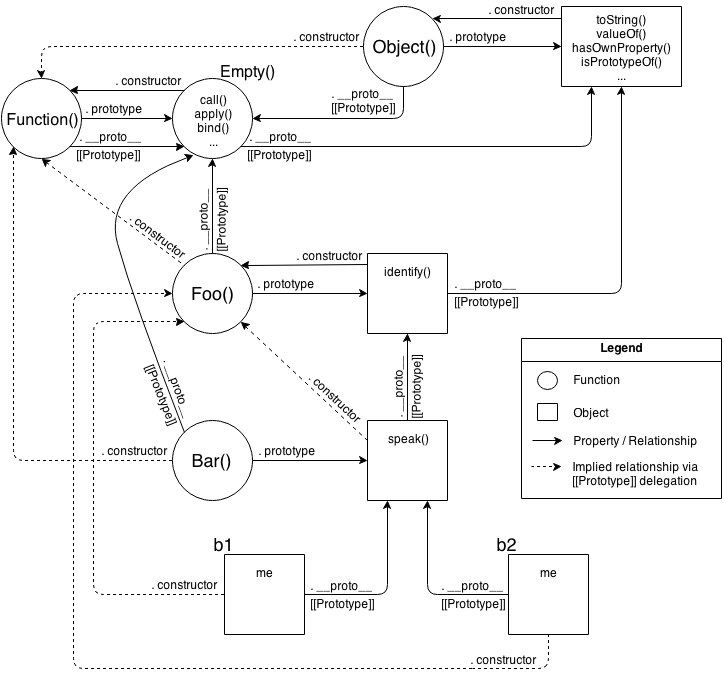

# ReLearning - 4

>  https://www.zhihu.com/question/53506191

###启示：强制把某些语言（比如Java）能够实现的思想（面向对象）移植到其他语言（比如JavaScript）可能不会是一件好事，但是往往符合工业生产节奏和人的思维方式

###同时也可以形成自己的编程风格，自己喜欢用哪种看着舒服就可以用

### Behavior Delegation

当一个属性/方法引用在第一个对象上发生，而这样的属性/方法又不存在时，这个链接就会被使用。在这种情况下，`[[Prototype]]`链接告诉引擎去那个被链接的对象上寻找该属性/方法。接下来，如果那个对象也不能满足查询，就沿着它的`[[Prototype]]`查询，如此继续。这种对象间一系列的链接构成了所谓的“原形链”。

换句话说，对于我们能在JavaScript中利用的功能的实际机制来说，其重要的实质 **全部在于被连接到其他对象的对象。**

### Towards Delegation-Oriented Design

1. Delegation Theory

   You will first define an **object** (not a class, nor a `function` as most JS'rs would lead you to believe) called `Task`, and it will have concrete behavior on it that includes utility methods that various tasks can use (read: *delegate to*!). Then, for each task ("XYZ", "ABC"), you define an **object** to hold that task-specific data/behavior. You **link** your task-specific object(s) to the `Task` utility object, allowing them to delegate to it when they need to.

   ```javascript
   var Task = {
   	setID: function(ID) { this.id = ID; },
   	outputID: function() { console.log( this.id ); }
   };

   // 使`XYZ`委托到`Task`
   var XYZ = Object.create( Task );

   XYZ.prepareTask = function(ID,Label) {
   	this.setID( ID );
   	this.label = Label;
   };

   XYZ.outputTaskDetails = function() {
   	this.outputID();
   	console.log( this.label );
   };

   // ABC = Object.create( Task );
   // ABC ... = ...
   ```

   作为与面相类（也就是，OO——面相对象）的对比，我称这种风格的代码为 **“OLOO”**（objects-linked-to-other-objects（链接到其他对象的对象））。所有我们 *真正* 关心的是，对象`XYZ`委托到对象`Task`（对象`ABC`也一样）。

   注意的不同：

   1. 前一个类的例子中的`id`和`label`数据成员都是`XYZ`上的直接数据属性（它们都不在`Task`上）。一般来说，当`[[Prototype]]`委托引入时，**你想使状态保持在委托者上**（`XYZ`，`ABC`），不是在委托上（`Task`）。
   2. 在类的设计模式中，我们故意在父类（`Task`）和子类（`XYZ`）上采用相同的命名`outputTask`，以至于我们可以利用覆盖（多态）。在委托的行为中，我们反其道而行之：**我们尽一切可能避免在[[Prototype]]链的不同层级上给出相同的命名**（称为“遮蔽”），因为这些命名冲突会导致尴尬/脆弱的语法来消除引用的歧义（见第四章），而我们想避免它。 这种设计模式不那么要求那些倾向于被覆盖的泛化的方法名，而是要求针对于每个对象的 *具体* 行为类型给出更具描述性的方法名。**这实际上会产生更易于理解/维护的代码**，因为方法名（不仅在定义的位置，而是扩散到其他代码中）变得更加明白（代码即文档）。
   3. `this.setID(ID);`位于对象`XYZ`的一个方法内部，它首先在`XYZ`上查找`setID(..)`，但因为它不能在`XYZ`上找到叫这个名称的方法，`[[Prototype]]`委托意味着它可以沿着链接到`Task`来寻找`setID()`，这样当然就找到了。另外，由于调用点的隐含`this`绑定规则（见第二章），当`setID()`运行时，即便方法是在`Task`上找到的，这个函数调用的`this`绑定依然是我们期望和想要的`XYZ`。我们在代码稍后的`this.outputID()`中也看到了同样的事情。 换句话说，我们可以使用存在于`Task`上的泛化工具与`XYZ`互动，因为`XYZ`可以委托至`Task`。

   -  相互委托（不允许）

      因为引擎的实现者发现，在设置时检查（并拒绝！）无限循环引用一次，要比每次你在一个对象上查询属性时都做相同检查的性能要高。

   -  浏览器间调试不同

   -  OO vs. OLOO

      ```javascript
      function Foo(who) {
      	this.me = who;
      }
      Foo.prototype.identify = function() {
      	return "I am " + this.me;
      };

      function Bar(who) {
      	Foo.call( this, who );
      }
      Bar.prototype = Object.create( Foo.prototype );

      Bar.prototype.speak = function() {
      	alert( "Hello, " + this.identify() + "." );
      };

      var b1 = new Bar( "b1" );
      var b2 = new Bar( "b2" );

      b1.speak();
      b2.speak();
      ```

      推荐以下写法:

      ```javascript
      var Foo = {
      	init: function(who) {
      		this.me = who;
      	},
      	identify: function() {
      		return "I am " + this.me;
      	}
      };

      var Bar = Object.create( Foo );

      Bar.speak = function() {
      	alert( "Hello, " + this.identify() + "." );
      };

      var b1 = Object.create( Bar );
      b1.init( "b1" );
      var b2 = Object.create( Bar );
      b2.init( "b2" );

      b1.speak();
      b2.speak();
      ```

      两段代码间的思维模式图片

   -  全图

      

   -  fair

      

   -  OLOO

      

2. Object vs. Class

   原始写法:

   ```javascript
   // 父类
   function Widget(width,height) {
   	this.width = width || 50;
   	this.height = height || 50;
   	this.$elem = null;
   }

   Widget.prototype.render = function($where){
   	if (this.$elem) {
   		this.$elem.css( {
   			width: this.width + "px",
   			height: this.height + "px"
   		} ).appendTo( $where );
   	}
   };

   // 子类
   function Button(width,height,label) {
   	// "super"构造器调用
   	Widget.call( this, width, height );
   	this.label = label || "Default";

   	this.$elem = $( "<button>" ).text( this.label );
   }

   // 使`Button` “继承” `Widget`
   Button.prototype = Object.create( Widget.prototype );

   // 覆盖“继承来的” `render(..)`
   Button.prototype.render = function($where) {
   	// "super"调用
   	Widget.prototype.render.call( this, $where );
   	this.$elem.click( this.onClick.bind( this ) );
   };

   Button.prototype.onClick = function(evt) {
   	console.log( "Button '" + this.label + "' clicked!" );
   };

   $( document ).ready( function(){
   	var $body = $( document.body );
   	var btn1 = new Button( 125, 30, "Hello" );
   	var btn2 = new Button( 150, 40, "World" );

   	btn1.render( $body );
   	btn2.render( $body );
   } );
   ```

   OO设计模式告诉我们要在父类中声明一个基础`render(..)`，之后在我们的子类中覆盖它，但不是完全替代它，而是用按钮特定的行为增强这个基础功能

   代码非常丑，比如含有`call`

   先说es6的 class 语法糖

   ```javascript
   class Widget {
   	constructor(width,height) {
   		this.width = width || 50;
   		this.height = height || 50;
   		this.$elem = null;
   	}
   	render($where){
   		if (this.$elem) {
   			this.$elem.css( {
   				width: this.width + "px",
   				height: this.height + "px"
   			} ).appendTo( $where );
   		}
   	}
   }

   class Button extends Widget {
   	constructor(width,height,label) {
   		super( width, height );
   		this.label = label || "Default";
   		this.$elem = $( "<button>" ).text( this.label );
   	}
   	render($where) {
   		super.render( $where );
   		this.$elem.click( this.onClick.bind( this ) );
   	}
   	onClick(evt) {
   		console.log( "Button '" + this.label + "' clicked!" );
   	}
   }
   ```

   1. class 能够解决的问题:

      1. 不再有（某种意义上的，继续往下看！）指向`.prototype`的引用来弄乱代码。
      2. `Button`被声明为直接“继承自”（也就是`extends`）`Widget`，而不是需要用`Object.create(..)`来替换`.prototype`链接的对象，或者用`__proto__`和`Object.setPrototypeOf(..)`来设置它。
      3. `super(..)`现在给了我们非常有用的 **相对多态** 的能力，所以在链条上某一个层级上的任何方法，可以引用链条上相对上一层的同名方法。有一个关于构造器的奇怪现象：构造器不属于它们的类，而且因此与类没有联系。`super(..)`含有一个对此问题的解决方法 —— `super()`会在构造器内部想如你期望的那样工作。
      4. `class`字面语法对指定属性没有什么启发（仅对方法有）。这看起来限制了某些东西，但是绝大多数情况下期望一个属性（状态）存在于链条末端的“实例”以外的地方，这通常是一个错误和令人诧异（因为这个状态被隐含地在所有“实例”中“分享”）的。所以，也可以说`class`语法防止你出现错误。
      5. `extends`甚至允许你用非常自然的方式扩展内建的对象（子）类型，比如`Array`或者`RegExp`。在没有`class .. extends`的情况下这样做一直以来是一个极端复杂而令人沮丧的任务，只有最熟练的框架作者曾经正确地解决过这个问题。

   2. class 的坑

      1. `class`很大程度上仅仅是一个既存的`[[Prototype]]`（委托）机制的语法糖！

         如果你在“父类”上更改/替换了一个方法（有意或无意地），子“类”和/或实例将会受到“影响”，因为它们在声明时没有得到一份拷贝，它们依然都使用那个基于`[[Prototype]]`的实时委托模型

      2. 同时还有遮蔽问题

      3. 还有一些关于`super`如何工作的微妙问题。`super`不是动态绑定的。它在声明时，被有些“静态地”绑定。

   3. 委托部件对象

      ```javascript
      var Widget = {
      	init: function(width,height){
      		this.width = width || 50;
      		this.height = height || 50;
      		this.$elem = null;
      	},
      	insert: function($where){
      		if (this.$elem) {
      			this.$elem.css( {
      				width: this.width + "px",
      				height: this.height + "px"
      			} ).appendTo( $where );
      		}
      	}
      };

      var Button = Object.create( Widget );

      Button.setup = function(width,height,label){
      	// delegated call
      	this.init( width, height );
      	this.label = label || "Default";

      	this.$elem = $( "<button>" ).text( this.label );
      };
      Button.build = function($where) {
      	// delegated call
      	this.insert( $where );
      	this.$elem.click( this.onClick.bind( this ) );
      };
      Button.onClick = function(evt) {
      	console.log( "Button '" + this.label + "' clicked!" );
      };

      $( document ).ready( function(){
      	var $body = $( document.body );

      	var btn1 = Object.create( Button );
      	btn1.setup( 125, 30, "Hello" );

      	var btn2 = Object.create( Button );
      	btn2.setup( 150, 40, "World" );

      	btn1.build( $body );
      	btn2.build( $body );
      } );
      ```

      使用这种OLOO风格的方法，我们不认为`Widget`是一个父类而`Button`是一个子类，`Wedget`**只是一个对象** 和某种具体类型的部件也许想要代理到的工具的集合，而且`Button`**也只是一个独立的对象**（当然，带有委托至`Wedget`的链接！）。

      从设计模式的角度来看，我们 **没有** 像类的方法建议的那样，在两个对象中共享相同的`render(..)`方法名称，而是选择了更能描述每个特定任务的不同的名称。同样的原因，*初始化* 方法被分别称为`init(..)`和`setup(..)`。

      语法上，我们也没有任何构造器，`.prototype`或者`new`出现，它们事实上是不必要的设计。

      你可能会注意到之前仅有一个调用（`var btn1 = new Button(..)`），而现在有了两个（`var btn1 = Object.create(Button)`和`btn1.setup(..)`）。这猛地看起来像是一个缺点（代码变多了）。和经典原型风格比起来也是 **OLOO风格代码的优点**

      原因：

      -  用类的构造器，你“强制”（不完全是这样，但是被强烈建议）构建和初始化在同一个步骤中进行。然而，有许多种情况，能够将这两步分开做（就像你在OLOO中做的）更灵活。**OLOO** 对关注点分离原则有 *更好* 的支持，也就是创建和初始化没有必要合并在同一个操作中

3. 简单设计

   行为委托作为一个模式实际上会带来更简单的代码架构

   -  ajax场景

      根据典型的类的设计模式，我们在一个叫做`Controller`的类中将任务分解为基本功能，之后我们会衍生出两个子类，`LoginController`和`AuthController`，它们都继承自`Controller`而且特化某些基本行为。

      原始模拟类的写法：

      ```javascript
      // 父类
      function Controller() {
      	this.errors = [];
      }
      Controller.prototype.showDialog = function(title,msg) {
      	// 在对话框中给用户显示标题和消息
      };
      Controller.prototype.success = function(msg) {
      	this.showDialog( "Success", msg );
      };
      Controller.prototype.failure = function(err) {
      	this.errors.push( err );
      	this.showDialog( "Error", err );
      };
      ```

      ```javascript
      // 子类
      function LoginController() {
      	Controller.call( this );
      }
      // 将子类链接到父类
      LoginController.prototype = Object.create( Controller.prototype );
      LoginController.prototype.getUser = function() {
      	return document.getElementById( "login_username" ).value;
      };
      LoginController.prototype.getPassword = function() {
      	return document.getElementById( "login_password" ).value;
      };
      LoginController.prototype.validateEntry = function(user,pw) {
      	user = user || this.getUser();
      	pw = pw || this.getPassword();

      	if (!(user && pw)) {
      		return this.failure( "Please enter a username & password!" );
      	}
      	else if (pw.length < 5) {
      		return this.failure( "Password must be 5+ characters!" );
      	}

      	// 到这里了？输入合法！
      	return true;
      };
      // 覆盖来扩展基本的`failure()`
      LoginController.prototype.failure = function(err) {
      	// "super"调用
      	Controller.prototype.failure.call( this, "Login invalid: " + err );
      };
      ```

      ```javascript
      // 子类
      function AuthController(login) {
      	Controller.call( this );
      	// 除了继承外，我们还需要合成
      	this.login = login;
      }
      // 将子类链接到父类
      AuthController.prototype = Object.create( Controller.prototype );
      AuthController.prototype.server = function(url,data) {
      	return $.ajax( {
      		url: url,
      		data: data
      	} );
      };
      AuthController.prototype.checkAuth = function() {
      	var user = this.login.getUser();
      	var pw = this.login.getPassword();

      	if (this.login.validateEntry( user, pw )) {
      		this.server( "/check-auth",{
      			user: user,
      			pw: pw
      		} )
      		.then( this.success.bind( this ) )
      		.fail( this.failure.bind( this ) );
      	}
      };
      // 覆盖以扩展基本的`success()`
      AuthController.prototype.success = function() {
      	// "super"调用
      	Controller.prototype.success.call( this, "Authenticated!" );
      };
      // 覆盖以扩展基本的`failure()`
      AuthController.prototype.failure = function(err) {
      	// "super"调用
      	Controller.prototype.failure.call( this, "Auth Failed: " + err );
      };
      ```

      ```javascript
      var auth = new AuthController(
      	// 除了继承，我们还需要合成
      	new LoginController()
      );
      auth.checkAuth();
      ```

      我们有所有控制器分享的基本行为，它们是`success(..)`，`failure(..)`和`showDialog(..)`。我们的子类`LoginController`和`AuthController`覆盖了`failure(..)`和`success(..)`来增强基本类的行为。还要注意的是，`AuthController`需要一个`LoginController`实例来与登录form互动，所以它变成了一个数据属性成员。

   -  去类化的OLOO风格写法(推荐)

      ```javascript
      var LoginController = {
      	errors: [],
      	getUser: function() {
      		return document.getElementById( "login_username" ).value;
      	},
      	getPassword: function() {
      		return document.getElementById( "login_password" ).value;
      	},
      	validateEntry: function(user,pw) {
      		user = user || this.getUser();
      		pw = pw || this.getPassword();

      		if (!(user && pw)) {
      			return this.failure( "Please enter a username & password!" );
      		}
      		else if (pw.length < 5) {
      			return this.failure( "Password must be 5+ characters!" );
      		}

      		// 到这里了？输入合法！
      		return true;
      	},
      	showDialog: function(title,msg) {
      		// 在对话框中向用于展示成功消息
      	},
      	failure: function(err) {
      		this.errors.push( err );
      		this.showDialog( "Error", "Login invalid: " + err );
      	}
      };
      ```

      ```javascript
      // 链接`AuthController`委托到`LoginController`
      var AuthController = Object.create( LoginController );

      AuthController.errors = [];
      AuthController.checkAuth = function() {
      	var user = this.getUser();
      	var pw = this.getPassword();

      	if (this.validateEntry( user, pw )) {
      		this.server( "/check-auth",{
      			user: user,
      			pw: pw
      		} )
      		.then( this.accepted.bind( this ) )
      		.fail( this.rejected.bind( this ) );
      	}
      };
      AuthController.server = function(url,data) {
      	return $.ajax( {
      		url: url,
      		data: data
      	} );
      };
      AuthController.accepted = function() {
      	this.showDialog( "Success", "Authenticated!" )
      };
      AuthController.rejected = function(err) {
      	this.failure( "Auth Failed: " + err );
      };
      ```

      因为`AuthController`只是一个对象（`LoginController`也是），我们不需要初始化（比如`new AuthController()`）就能执行我们的任务。所有我们要做的是：

      ```javascript
      AuthController.checkAuth();
      ```

      `AuthController`和`LoginController`**仅仅是对象**，互相是 *水平* 对等的，而且没有被安排或关联成面向类中的父与子。我们有些随意地选择让`AuthController`委托至`LoginController` —— 相反方向的委托也同样是有效的。

4. 自省

   ​